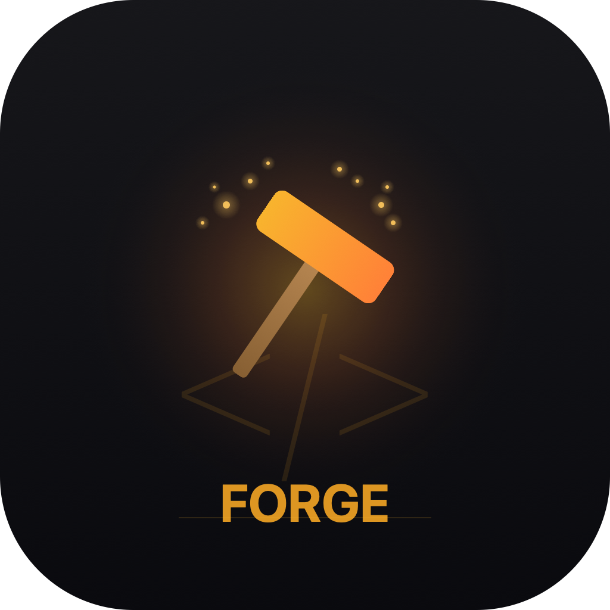
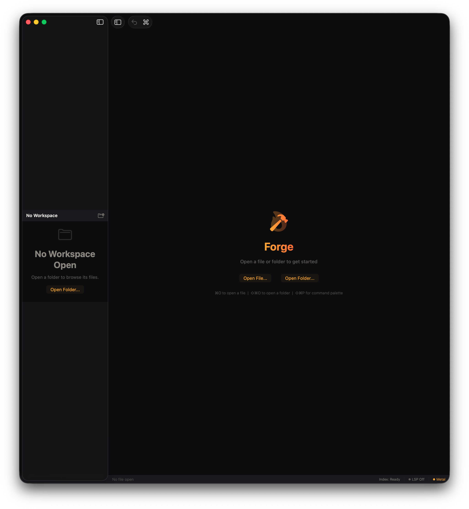

<p align="center">
  
</p>

<h1 align="center">Forge</h1>

<p align="center">
  <strong>A GPU-accelerated code editor forged from metal and fire.</strong><br/>
  Native macOS. Metal-rendered. Zero compromises.
</p>

<p align="center">
  
  
  
  
</p>

---

<p align="center">
  
</p>

---

## What is Forge?

Forge is a **native macOS code editor** that renders text directly on the GPU using Apple's Metal framework. No Electron. No web views. No compromise.

Built entirely in **Swift 6** with strict concurrency, SwiftUI for the interface, and SwiftData for persistence — it's what a code editor looks like when you build it specifically for Apple Silicon.

## Highlights

```
 Metal GPU Rendering     Text rendered at native refresh rate via compute shaders
 Gap Buffer Engine       Sub-millisecond edits on files up to 10MB
 Tree-sitter Parsing     Incremental syntax highlighting that doesn't block the UI
 LSP Integration         Language Server Protocol for completions & diagnostics
 Semantic Indexing       On-device file indexing powered by CoreML embeddings
 Molten Craft UI         Dark-first design with warm amber accents and spring animations
```

## Architecture

Forge is built as **6 independent Swift modules** connected through a shared type layer:

```
┌─────────────────────────────────────────────────────┐
│                     ForgeApp                        │
│            SwiftUI · Molten Craft Theme              │
├──────────┬──────────┬───────────┬───────────────────┤
│  Editor  │ Renderer │    LSP    │     Indexer        │
│  Engine  │  (Metal) │ Protocol  │    (CoreML)        │
│──────────│──────────│───────────│───────────────────│
│ GapBuffer│ Shaders  │ JSON-RPC  │  Embeddings        │
│ UndoTree │ Glyph    │ Lifecycle │  SwiftData         │
│ TreeSit. │ Atlas    │ Transport │  Persistence       │
├──────────┴──────────┴───────────┴───────────────────┤
│                   ForgeShared                        │
│         Types · Protocols · Sendable Models          │
└─────────────────────────────────────────────────────┘
```

| Module | Purpose |
|--------|---------|
| **ForgeShared** | Sendable types, protocols, and data models shared across all modules |
| **ForgeEditorEngine** | Gap buffer, undo/redo tree, multi-cursor, Tree-sitter syntax highlighting |
| **ForgeRendering** | Metal compute shaders for GPU text rendering with glyph atlas caching |
| **ForgeLSP** | Language Server Protocol client with JSON-RPC transport and auto-restart |
| **ForgeIndexer** | On-device semantic file indexing using CoreML embeddings |
| **ForgePersistence** | SwiftData persistence layer for workspace state and settings |

## Design: Molten Craft

Forge ships with a custom design system called **Molten Craft** — a near-black base (`#0D0D0F`) with warm amber-to-orange accents, glassmorphic panels, spring animations, and an 8px spacing grid.

| Token | Value | Usage |
|-------|-------|-------|
| `base` | `#0D0D0F` | Editor background |
| `surface` | `#1A1A1E` | Panels, sidebar, status bar |
| `accent` | `#F5A623 → #FF6B2C` | Gradient on active elements |
| `textPrimary` | `#F0EDEA` | Warm off-white body text |
| `textSecondary` | `#8A8680` | Labels, inactive items |

## Getting Started

### Requirements

- macOS 15.0+ (Sequoia)
- Apple Silicon (M1 or later)
- Swift 6.0+ toolchain

### Build & Run

```bash
# Clone
git clone https://github.com/salvadalba/nodaysidle_forge.git
cd nodaysidle_forge

# Build
swift build -c release

# Package as .app
APP_NAME=Forge BUNDLE_ID=com.nodaysidle.forge \
  MACOS_MIN_VERSION=15.0 SIGNING_MODE=adhoc \
  Scripts/package_app.sh release

# Launch
open Forge.app
```

### Run Tests

```bash
swift test    # 49 tests across 2 suites
```

### Dev Loop

```bash
# Kill → rebuild → relaunch in one command
APP_NAME=Forge BUNDLE_ID=com.nodaysidle.forge \
  MACOS_MIN_VERSION=15.0 SIGNING_MODE=adhoc \
  Scripts/compile_and_run.sh
```

## Keyboard Shortcuts

| Action | Shortcut |
|--------|----------|
| Open File | `⌘O` |
| Open Folder | `⇧⌘O` |
| Command Palette | `⇧⌘P` |
| Save | `⌘S` |
| Close Tab | `⌘W` |
| Reopen Closed Tab | `⇧⌘T` |
| Undo / Redo | `⌘Z` / `⇧⌘Z` |

## Project Structure

```
nodaysidle-forge/
├── Package.swift              # SwiftPM manifest (6 modules)
├── Sources/
│   ├── ForgeShared/           # Shared types and protocols
│   ├── ForgeEditorEngine/     # Gap buffer, syntax, undo tree
│   ├── ForgeRendering/        # Metal shaders and glyph rendering
│   ├── ForgeLSP/              # Language Server Protocol client
│   ├── ForgeIndexer/          # CoreML semantic indexing
│   ├── ForgePersistence/      # SwiftData persistence
│   └── ForgeApp/              # SwiftUI application layer
│       ├── ForgeApp.swift
│       ├── ForgeTheme.swift   # Molten Craft design system
│       ├── MainEditorView.swift
│       ├── SidebarView.swift
│       ├── TabBarView.swift
│       ├── StatusBarView.swift
│       ├── CommandPalette.swift
│       └── ...
├── Tests/
│   ├── ForgeEditorEngineTests/
│   └── ForgeLSPTests/
├── Scripts/
│   ├── package_app.sh         # Build → .app bundle
│   └── compile_and_run.sh     # Dev loop
└── assets/
    └── forge-icon.png
```

## Why Another Editor?

Most code editors run in a browser engine. That's fine — until you want native scroll physics, Metal-accelerated rendering, sub-frame input latency, and proper macOS integration.

Forge exists because **the Mac deserves a code editor that's actually built for it.**

---

<p align="center">
  <sub>Built with Swift, Metal, and an unreasonable amount of attention to detail by nodaysidle.</sub>
</p>
